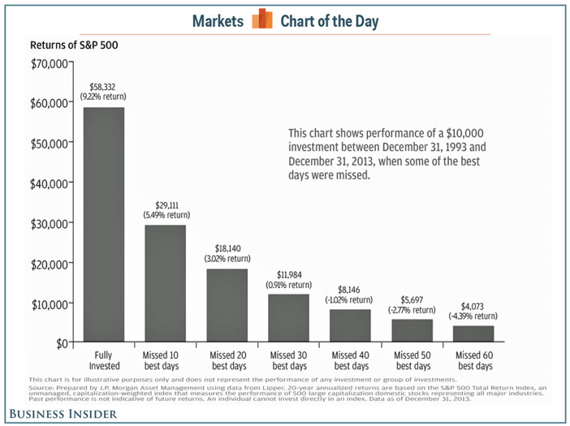

# Laws of Physics
Here are some laws of physics for investing.  Ok, they’re not really Newton-esqe, but they’re true enough that you should pay attention to them.

# Risk:Return

This is a truism of finance.  The higher your risk, the higher your potential return.  Also, the more likely it could go to zero.  That’s the risk side of it.  In general, you want to have a balanced portfolio and we’ll go into that later.  

# Debt

Debt is exactly like weight.  If you want to gain weight, the only to do that is to take in more calories than you burn.  The only way to lose weight is to burn more calories that you take in.

For debt, the only way to lose it is to spend less than you make.  The only way to gain it is to make less than you spend.

# Get Rich Not-So-Quick

>"Time in the market is more important than timing the market." -Unknown

Starting out, I’m going to make some broad statements.  For now, take them at face value.  I’ll provide the in-depth analysis with sources later, but at this point it would probably be distracting.

Human beings are terrible at investing.  Probably worse about writing about investing, but let’s ignore that.  There are probably a lot of well documented psychological explanations for it, but I like to blame our stupid monkey-brains.  Money is an abstract concept, and we’re better at dealing with concrete items. But even as we get better at dealing with the fact that the numbers on a piece of paper matter, we get worse at separating our emotions from our money.  When you see your investments decrease you experience real regret.   For most people the bad emotions from loss are greater than the satisfaction with seeing gains ([Paz, 2012](https://www.ncbi.nlm.nih.gov/pubmed/22553036)). The result is that people are likely to sell when things are going down, and buy only when they see them going up, which honestly doesn’t sound that bad.   The net effect is that you fail to minimize your losses and you miss the times of greatest gains.  If you missed 10 specific days in the stock market from 1993 to 2003 you missed nearly 50% of the gain.  ([Ro, 2014](https://www.businessinsider.com/cost-of-missing-10-best-days-in-sp-500-2014-3))
 

Even without looking at specific stocks, the same is true for broader funds.  Although funds have published gains of 12%, most people make way less than that due to buying high and selling low.

## Behavior
We’re going to go off on a bit of a tangent here.  If you were going to Google [“Why does the average investor underperform the market?”](http://lmgtfy.com/?q=why+does+the+average+investor+underperform+the+market)  you would quickly run into gruesome quotes like:

> “For the twenty years ending 12/31/2015, the S&P 500 Index averaged 9.85% a year. A pretty attractive historical return. The average equity fund investor earned a market return of only 5.19%.” ([Anspach, 2018](https://www.thebalance.com/why-average-investors-earn-below-average-market-returns-2388519))

The problem with this is that all of these statistics tend to come from one place, [Dalbar](https://www.dalbar.com/).   Now, until I really dug into this, I didn’t know who they were either.  But from their homepage:

> “DALBAR, Inc. is the financial community’s leading independent expert for evaluating, auditing and rating business practices, customer performance, product quality and service. “

Which clearly looks like a conflict of interest, since their customers are financial advisors.  However, that in and of itself wouldn’t be a reason to dismiss their [annual study](http://svwealth.com/wp-content/uploads/2018/04/dalbar_study.pdf), but does mean that you need to do some research.  Or, I guess, trust that I’ve done that.

Like every good internet flamewar, there are some great back and forths.  Over at [Advisor Perspectives](https://www.advisorperspectives.com/articles/2017/03/06/a-warning-to-the-advisory-profession-dalbar-s-math-is-wrong) you can see the primary combatants, Pfau and Harvey.  However, I think the best analysis is over at [Kitces](https://www.kitces.com/blog/does-the-dalbar-study-grossly-overstate-the-behavior-gap-guest-post/), which shows that, if you buy and hold you do just fine.  But, if you really want to dig deeper, there is a ton of academic material on the subject.  One paper I’ve found, that has a good summary is [“The Behavior of Individual Investors”](https://www.umass.edu/preferen/You%20Must%20Read%20This/Barber-Odean%202011.pdf).  The conclusion says:

> “The investors who inhabit the real world and those who populate academic models are distant cousins. In theory, investors hold well diversified portfolios and trade infrequently so as to minimize taxes and other investment costs. In practice, investors behave differently. They trade frequently and have perverse stock selection ability, incurring unnecessary investment costs and return losses. They tend to sell their winners and hold their losers, generating unnecessary tax liabilities. Many hold poorly diversified portfolios, resulting in unnecessarily high levels of diversifiable risk, and many are unduly influenced by media and past experience. Individual investors who ignore the prescriptive advice to buy and hold low-fee, well-diversified portfolios, generally do so to their detriment. “ (Barber, 2011)

There is also a great table at the end of the paper titled “Table 1: Summary of Articles on the Performance of Individual Investors” that does a good job of summarizing a wide variety of papers.

Finally, recognize even if you are the [World's Worst Market Timer](https://awealthofcommonsense.com/2014/02/worlds-worst-market-timer/), as long as you stay in the market, you'll be ok. 

# What to do
Now, knowing all of these things is the key to maximizing your chances of retiring in luxurious comfort.  Here’s how.

You know:
* Most people make poor decisions trying to time buying and selling
* You are most people
* Over the long term the market will likely earn ~7%

So, you will invest in the market and then you will ignore your investments for years to come.  Here is my micro strategy:

* I watch my investments when the stock market is going up and I ignore them when it is going down.

