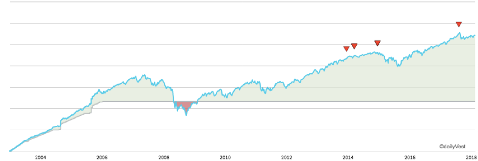

# Actual Results

I know a lot of these discussions seem a little abstract, and it’s really easy to read what people say you should do, but what do they do, and does it work?  So, to that end, here is personal example.

I worked for a company from September of 2003 until May of 2006.  In that time, I contributed to my 401k, entirely into index funds.  (Maybe not the best ones, but we all learn).  I haven’t rolled this over to something else, so it provides a great view into a single long-term investment.

The thin line at the bottom is my total contributions.  The blue line at the top is total value of the portfolio.  The little red markers are when I made a change to allocations.

My cumulative personal return is just under 147%, which annualizes to 6.2%.  

You’ll notice that when the Great Recession hit in 2008, the value of the portfolio was actually worth less than the amount of money I had put in.  But, in less than 2 years it had recovered and it took nearly 6 years to recover to the highs of 2007, but it has continued to climb.

So, here is an actual example of how a long term buy and hold strategy for index funds works in the real world.

But how did I do compared to the S&P 500?  Well, good but not great?  From January of 2004 until March of 2018, S&P 500 total return was 139% with an annualized return of 6.3%.  So seems like I did pretty dang good!  What about with dividends reinvested?  217% and 8.5%, so maybe I didn’t do that great (S&P 500 Return Calculator, with Dividend Reinvestment, 2018).  I will say, I think part of it is because I didn’t have enough low cost, index funds, something I have slowly fixed in the last few years.  But, in spite of that, I have managed to at least pace the market, for this investment.
